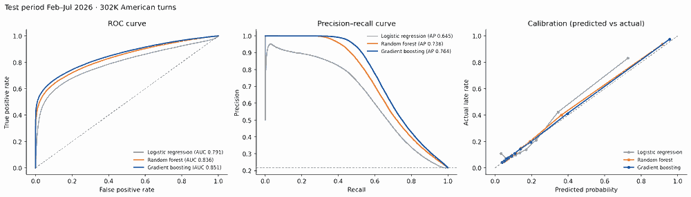
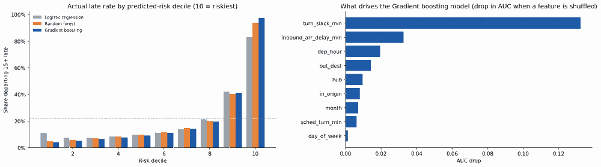

# Why are American's hub departures late?

I built this project to see how delay moves through an airline hub. When a plane lands late, how often does it leave late again? And which turns can a hub team actually save?

I used two years of public flight data from the U.S. Department of Transportation (BTS) and focused on American Airlines' five biggest connecting hubs: DFW, CLT, ORD, PHL and MIA. The processing runs in Databricks, the results are in a Tableau dashboard, and at the end there's a small model that flags risky turns when a plane lands.

**Dashboard:** [Tableau Public](TABLEAU_LINK_HERE)

A note on data: everything here comes from public BTS on-time files (Aug 2024 – Jul 2026). None of it is internal American Airlines data.

## What I found

| Hub | AA departures | Left on time (D0) | 15+ min late | Cancelled |
|---|---:|---:|---:|---:|
| DFW | 549,610 | 55.2% | 28.5% | 2.7% |
| CLT | 433,251 | 61.9% | 22.8% | 1.9% |
| ORD | 289,677 | 59.6% | 26.3% | 2.4% |
| PHL | 186,936 | 66.9% | 20.9% | 2.4% |
| MIA | 156,388 | 58.9% | 25.2% | 1.5% |

A few things stood out:

- **Most delay is inherited.** At every hub, "late-arriving aircraft" is the biggest delay cause, at 40–48% of delay minutes. The hub often isn't causing the delay; it's passing it along.
- **Short turns can't absorb it.** When a plane arrived 15+ minutes late with less than 45 minutes of scheduled ground time, the next flight also left 15+ late 89% of the time. With 60–89 minutes it was 61%, and with two hours or more it was 39%. At DFW the short-turn number was 96%.
- **Delay builds through the day.** At DFW, 71% of 7–8 AM departures leave on time. By the 6 PM and 8 PM banks it's closer to 42%.
- **It's not just DFW being DFW.** Other airlines at DFW left on time 63.5% of the time, compared with American's 55.2%.

These are patterns in the data, not proof of cause. BTS only records delay causes for flights that were 15+ minutes late.

## Predicting risky turns

Once I could see the pattern, I wanted to know whether you could spot a bad turn before it happens. The question I gave the model: *the plane just landed; will its next departure be 15+ minutes late?*

It only gets information you'd actually have at that moment: which hub, where the plane came from and where it goes next, time of day, weekday, month, scheduled turn time, how late the inbound was, and how much slack is left.

I trained on Aug 2024 – Jan 2026 and tested on the six months after that (302K turns, 21.7% of them late). I compared three models:

| Model | ROC AUC | PR AUC | Late rate in the 10% of turns it flags as riskiest |
|---|---:|---:|---:|
| Logistic regression (baseline) | 0.791 | 0.645 | 83.1% |
| Random forest | 0.836 | 0.736 | 93.7% |
| Gradient boosting | **0.851** | **0.764** | **97.5%** |

Gradient boosting won. If a hub team only looked at the 10% of turns it flags, nearly all of them (97.5%) really do go out late, compared with about 22% of turns overall. The probabilities are also honest: when it says 40%, roughly 40% of those turns are late. At its chosen cut-off it catches 59% of late departures, and 80% of its alerts are correct.

Unsurprisingly, the most important input by far is **turn slack**: scheduled ground time minus how late the plane arrived.




The model is tracked in MLflow and registered in Unity Catalog as `workspace.aa_ops.delay_risk_model@champion`.

## How it's built

```
BTS zip files ──▶ bronze ──▶ silver ──▶ gold ──▶ Tableau
                                 └──────▶ model (MLflow)
```

| Notebook | What it does |
|---|---|
| `01_ingest_bronze.py` | Downloads 24 monthly files from BTS into a Databricks volume and loads all 15.5M rows as-is |
| `02_silver_clean.py` | Keeps flights touching the 5 hubs, fixes types and timestamps, removes duplicates, quarantines bad rows, and pairs each arriving plane with its next departure (1.2M turns) |
| `03_gold_kpis.sql` | Builds the KPI tables the dashboard uses: daily and hourly on-time rates, delay causes, turn risk, peer comparison |
| `04_export_for_tableau.py` | Writes the gold tables to CSV, since Tableau Public can't connect to Databricks directly |
| `05_ml_delay_risk_model.py` | Trains and compares the three models, draws the charts, and registers the winner |

The four data notebooks run as one Databricks job.

Some of the fiddly parts that took the most time:

- **Times.** BTS stores times as `hhmm` numbers, including `2400`, in local time. A flight that leaves at 11 PM and lands at 1 AM, or crosses time zones, needs care. I roll the arrival to the next day when it would otherwise land more than 6 hours "before" it took off.
- **Pairing turns.** A turn is the same tail number arriving at a hub and then departing from that hub, with 20 minutes to 6 hours on the ground, and neither flight cancelled.
- **Averages.** Every rate is weighted by the number of flights, never a plain average of percentages. A quiet 11 PM hour shouldn't count as much as a busy 8 AM bank.
- **Bad rows.** Rows with missing delays, delays over 24 hours or 5-hour taxi times go to a quarantine table instead of being silently dropped. There were 1,024 of them.

## Terms

- **D0:** left at or before the scheduled time
- **D15:** left 15 or more minutes late
- **A14:** arrived within 14 minutes of schedule
- **Turn:** a plane's time on the ground between arriving and leaving again
- **Propagation rate:** of turns where the inbound was 15+ late, the share where the outbound was too

## What I'd do with more time

- Add crew connections. A late pilot can delay a flight even if the plane is ready, and that's missing here (I looked at pilot connections separately in an American Airlines hackathon).
- Use real minimum turn times by aircraft type instead of one set of buckets for every fleet.
- Add weather data to separate bad days from bad schedules.

## Running it yourself

1. Sign up for [Databricks Free Edition](https://www.databricks.com/learn/free-edition).
2. Import the `notebooks` folder and run 01 → 05 in order. The first run downloads about 900 MB and takes roughly 15 minutes.
3. The CSVs for Tableau end up in `/Volumes/workspace/aa_ops/raw_bts/exports/`.

---

Prithwiraj Chatterjee · M.S. Applied Statistics & Data Science, UT Arlington · [LinkedIn](https://linkedin.com/in/pvthirteen)
